# 5DICE

[View the deployed site here](https://hashtag-squirrel.github.io/five-dice/)

5DICE is a game of chance and strategy for players of all ages. 

The core gameplay consists of several rounds with three rolls each, where you try to achieve as high a score as possible with different combinations of your five dice.

To improve your score, you can decide to roll only specific dice on subsequent rolls in your turn, and after at most three rolls, you have to pick a score. 

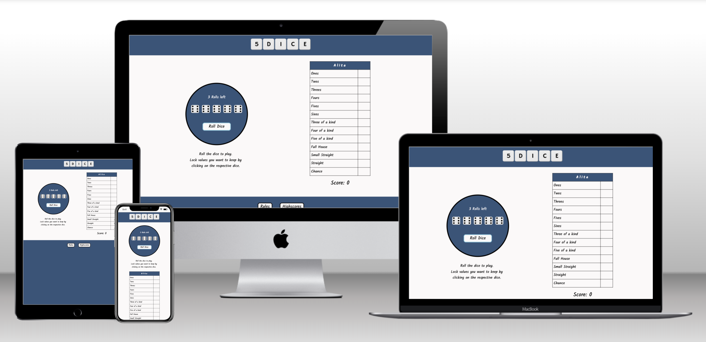

## Table of Contents
- [5DICE](#5dice)
  - [Table of Contents](#table-of-contents)
  - [UX](#ux)
    - [User Stories](#user-stories)
    - [Visual Design](#visual-design)
      - [__Wireframes__](#wireframes)
        - [Desktop](#desktop)
        - [Tablet](#tablet)
        - [Phone](#phone)
      - [__Colors__](#colors)
      - [__Fonts__](#fonts)
      - [__Images__](#images)
  - [Features](#features)
    - [Existing Features](#existing-features)
    - [Features Left to Implement](#features-left-to-implement)
  - [Technologies used](#technologies-used)
    - [Languages](#languages)
    - [Frameworks, Libraries](#frameworks-libraries)
    - [APIs](#apis)
    - [Other Tools](#other-tools)
  - [Testing](#testing)
    - [Methods](#methods)
      - [__Validator Testing__](#validator-testing)
      - [__Lighthouse Testing__](#lighthouse-testing)
      - [__General Testing__](#general-testing)
    - [Bugs](#bugs)
      - [__Known Bugs__](#known-bugs)
      - [__Fixed Bugs__](#fixed-bugs)
  - [Deployment](#deployment)
  - [Credits](#credits)
    - [Content](#content)
    - [Media](#media)
      - [__Images__](#images-1)

----

## UX

### User Stories

- First-time visitors
    - As a first-time visitor, I want to be able to play a game from start to finish, which includes the functionality listed below as MVP
    - As a first-time visitor, I want to have a personalized game experience

- Returning visitors
    - As a returning visitor, I want to be able to see my previous scores
    - As a returning visitor, I want to have my name saved from a previous visit
  
- Business owner
  - As a business, I want to offer a polished product
  - As a business, I want to offer a fun game experience

- MVP Functionality

    The basic functionality needed for an MVP consists of the following: 

    - 1 Player Game
    - Calculating a score per field
    - Calculating the total score on every turn
    - Rolling the dice
    - Indicating how many rolls are left per turn
    - Locking the dice 
    - Picking a field for the current turn
    - Ending a turn once a field is picked
    - Displaying the rules

### Visual Design

#### __Wireframes__

Wireframes were created at the beginning of the design process using Balsamiq for Desktop, Tablets (horizontal and vertical orientation), and Smartphones (vertical orientation). Some design elements were changed in the finished product. 

The structural design was kept as simple as possible, with the goal of not distracting from the gameplay and having the main parts of the game front and center at all times. 

For smaller screens, the elements will be aligned vertically, so the elements are still prominent in the middle of the screen and not too small.

##### Desktop
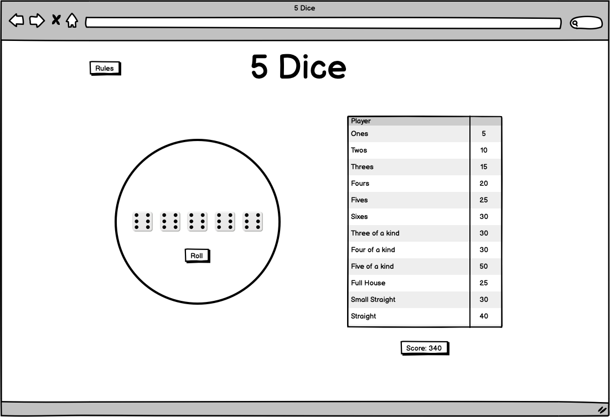

##### Tablet
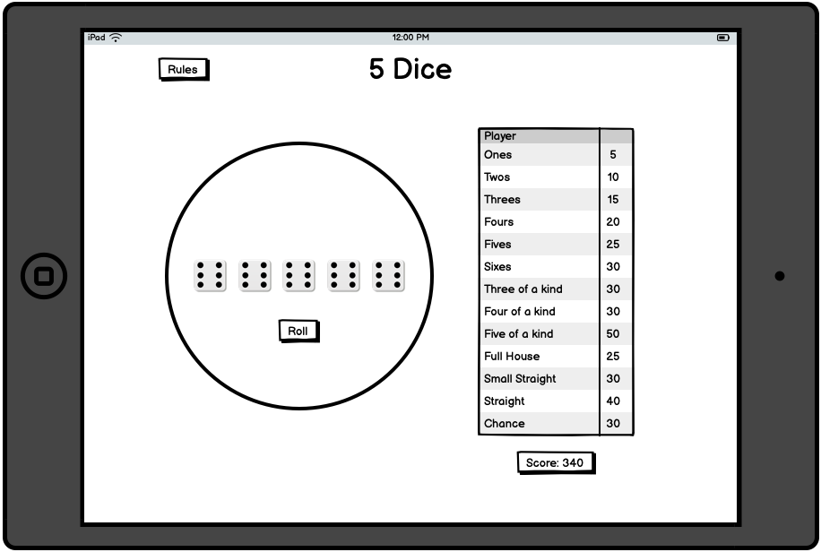
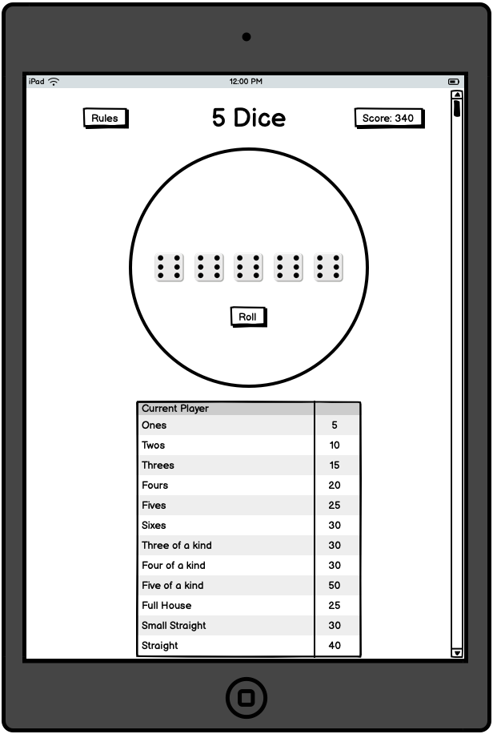

##### Phone
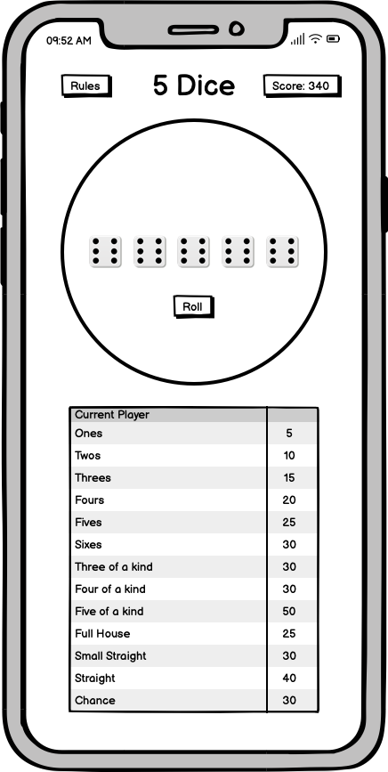

#### __Colors__

The color palette was chosen using [Colormind.io](http://colormind.io/).
I chose a calm color palette, again with the goal of not distracting too much from the game itself. 

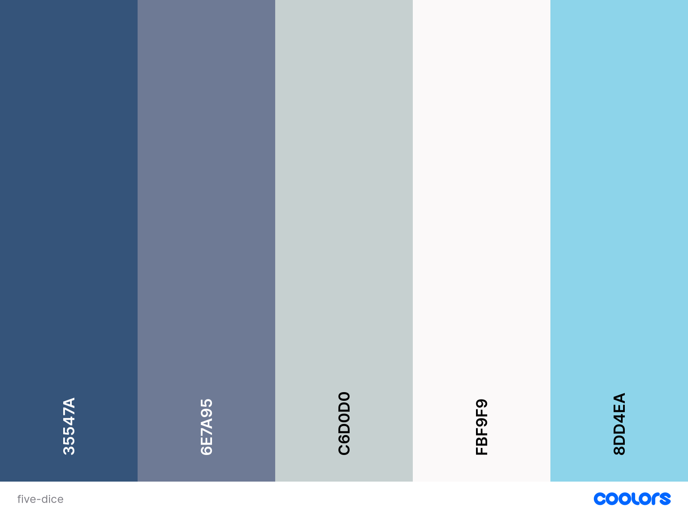

#### __Fonts__

At the beginning of the design process, I chose the fonts Roboto and Amatic SC (both from [Google Fonts](https://fonts.google.com/)). 

I wanted to have a font that had a handwritten style for the scoresheet, to make it feel like the player was writing down scores themselves. 

I quickly decided to use the same font across the whole site (apart from the logo), since it looked too busy with two different fonts. 
I also received the feedback, that Amatic SC was too thin and hard to read, so I switched to Kalam, also imported from [Google Fonts](https://fonts.google.com/).

#### __Images__

I wanted to keep the site as minimalistic as possible since the game itself has very few elements as well. I chose a very simple dice image to display the five dice in the game area and used the same dice to create the logo using [Canva](https://www.canva.com/).

## Features 

### Existing Features
WIP
- __Logo__
    
    The Logo of the site was designed to look appealing to the player and to help with recognition of the site for returning players. It features five dice with one number and four letters in them to spell out the name of the game. 

    At the same time, the logo is also a link to the site itself, so it can be used to reload the page if desired. 

    To distance itself more from the main area of the site, the logo/header has a dark blue background.

- __Game Area__
    
    The Game Area is one of two main areas of interaction for the player. 
    It is located prominently and designed in a way that it doesn't change its size or shape at any point. 

    It includes three main parts:
    - It displays the number of rolls left in a round
    - It displays the five dice and their values
    - It has a button to roll the dice, which is highlighted when it can be used and gets disabled when all rolls were used in a turn. 
      - In its enabled state, the button has a blue border and turns blue when the player hovers over it, to make it clear that it can be interacted with.
      - In its disabled state, it turns grey and also changes its text to make it clear that the player should choose a score now.
      - When the player tries to roll when the button is disabled, there is an alert to inform the player to please pick a score first.

    When the player rolls the dice, the turns are reduced with each roll, and the dice update to display the new values. After the first roll, the player can lock the dice by clicking on them if they want to keep any value(s). The player can also unlock the dice at any point during the turn. 

    After the player chooses a score (more on this in the next section), all dice unlock automatically and the roll button gets enabled again. 

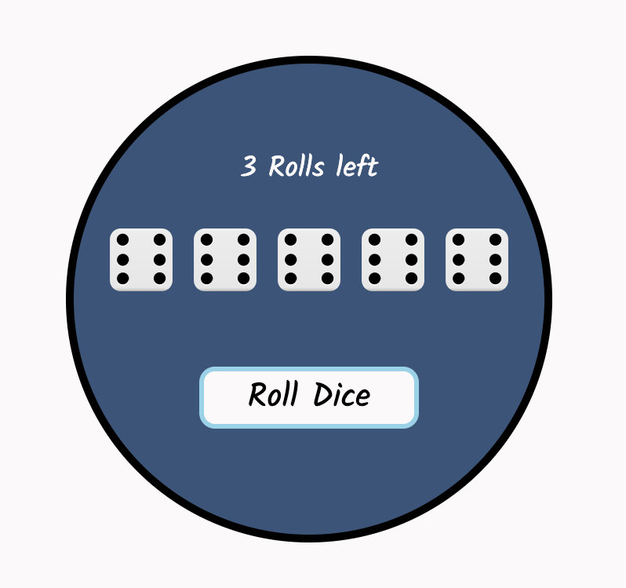
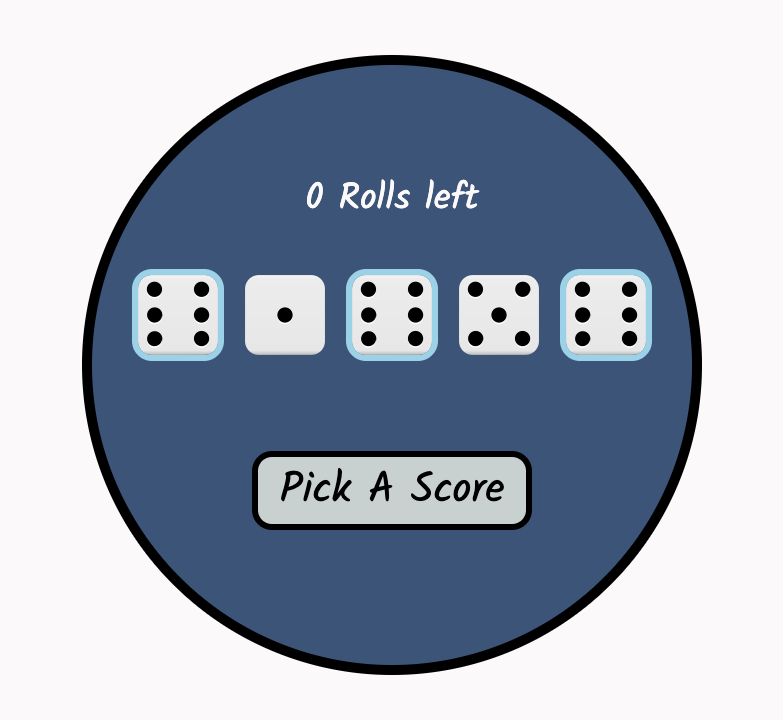

- __Hint Area__

    At the beginning of the first game, the Hint Area displays two different hints on how the game is played to the player.

    The first hint is displayed as long as the player can roll the dice. It explains to the player that they are supposed to roll the dice to play, and how to lock the dice. 

    The second hint is displayed as soon as the third roll is done and the player needs to pick a score. It tells the player to pick a table row to enter the score and that the explanation of the scores can be found when clicking on Rules. 

    The Hint Area gets hidden after the first score is picked, or as soon as the player clicks on Rules or Highscores, assuming that the player is familiar with the game already if they click away. 

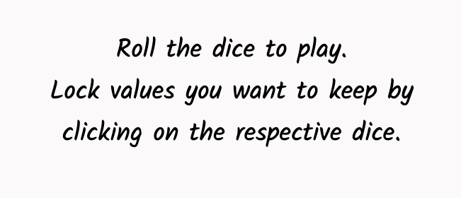
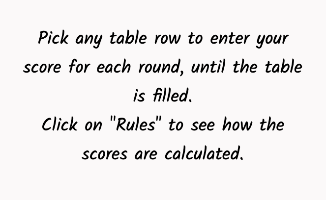

- __Scoresheet Area__
    
    The Scoresheet Area consists of two main elements: the scoresheet itself and the total score display.

    The scoresheet has a header displaying the chosen name of the player, which the player is asked to input when first loading the game. The name is then saved in localStorage. If the player decides not to input a name, the site gets a random name from a random user generator API. The random name does not get saved in localStorage. 

    The other rows in the scoresheet show the different types of scores and the score the player enters in that field (or empty for scores that are not yet picked).
    When hovering over the table rows, they change the background color to a light blue to indicate that the player can input something here. 
    When the player tries to input something in a row that was picked previously, an alert informs the player to please pick another field. 
    The total score gets updated every time the player enters a score in the table.

    The player can input a score after the first, second, or third roll each round, they don't have to use all rolls every round.
    The player can also input any score in any field, but it may be 0 if not matching the conditions for the field. 

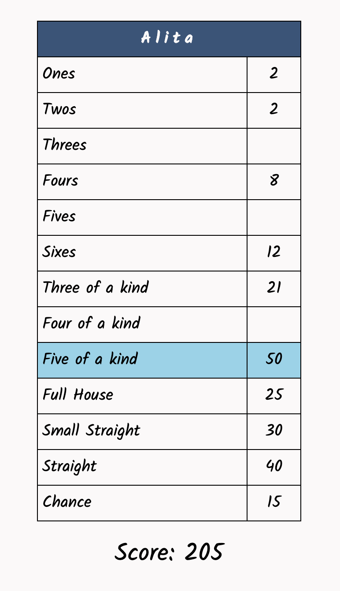

- __Footer__

    The footer is very simple. Like the header/logo, it has a dark blue background to distance itself from the main area of the site. 

    It only features two buttons in the same style as the roll button for consistency across the site. The buttons overlay the game and scoresheet areas with the Rules and Highscores respectively. 

    They are expressly not navigating to new pages, since the session is not stored, so reloading the page resets the game. 

- __Rules__

The Rules section is displayed when clicking on the Rules button in the footer. All other sections apart from the header with the logo get hidden, but the game does not get interrupted/refreshed. 

It is divided into two main parts: How to play and How the scores work.
The first part explains the rules of the game itself and the second part explains how the scores are calculated row by row. 

Below the explanations, there is a button that, when clicked, hides the Rules section again and takes the player back to their game. 

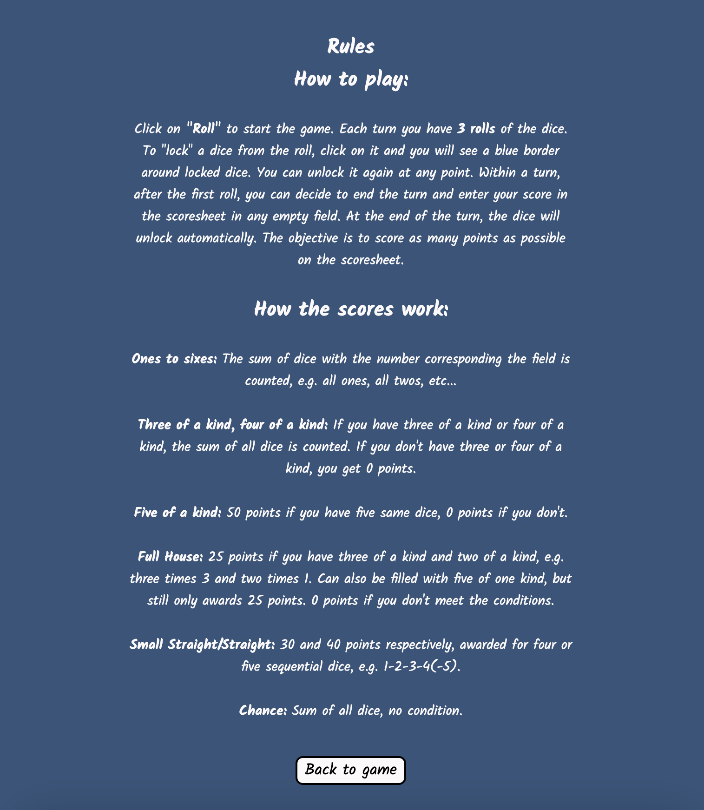

- __Highscores__

The Highscores section displays the 10 best games by rank, name, and score. When the player first plays, the table is not empty, but instead contains scores and a "challenge", spelling out "Can you beat these scores that are hard-coded here" in the Name column. 

At the end of a game, the player's name is entered in the Highscores and the last position in the Highscores array gets removed.

For better readability, the columns alter in background color between dark blue and lighter blue. 

Like the Rules section, the Highscores section also has a button to take them back to the game. 

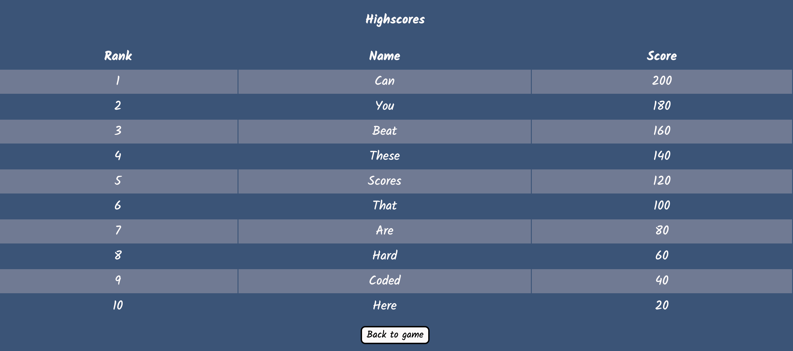

- __Additional Features__

    There were a couple of features added to the MVP because there was enough time. Mostly, they were chosen by how much impact they had on the User Experience. 

    The additional features were:
    - The changing of the player name
    - Using a random name if the player doesn't want to enter a name via an API call
    - The addition of the Highscores

### Features Left to Implement

There is still a lot of opportunity to improve the game. The following feature ideas came up during planning but were left out according to prioritization comparing impact and complexity. 

- Cosmetic additions:
    - Change the theme of the game area and save it in localStorage
      - Different styles could be picked by the player depending on their preference, e.g. simple, colors, DnD (with background image with dragons), and saved in localStorage so the page loads the same every time
    - Animate dice roll
      - The dice could be changing dice face when rolling the dice for a few seconds to make the roll feel more dynamic

- Functional additions:
    - 2 Player Game
      - A second player (or more) could be added and it could be turn-based to make it more competitive
    - Player vs. Computer Game
      - An AI player could be added to play against the player
    - Helper function that precalculates potential scores and makes decisions easier
      - The helper function could display the current roll in all empty fields with the theoretical value in italics, making it easier to make optimal decisions for the player. Additionally, it could be displayed as a current roll/best score, for example, the best score for the Ones would be 5, whereas it would be 30 for the Sixes. 

## Technologies used

### Languages
- HTML5
- CSS3
- (vanilla) JavaScipt

### Frameworks, Libraries
No Frameworks or Libraries were used in this project

### APIs
- [Random User Generator API](https://randomuser.me/)

### Other Tools
- [Mockup Generator](https://techsini.com/multi-mockup/index.php)
- [Balsamiq](https://balsamiq.com/)

## Testing 

### Methods

#### __Validator Testing__

- HTML
    - No errors were returned when passing through the official [W3C validator](https://validator.w3.org/nu/?doc=https%3A%2F%2Fhashtag-squirrel.github.io%2Ffive-dice%2F)
- CSS
    - No errors were found when passing through the official [(Jigsaw) validator](http://jigsaw.w3.org/css-validator/validator?lang=en&profile=css3svg&uri=https%3A%2F%2Fhashtag-squirrel.github.io%2Ffive-dice%2F&usermedium=all&vextwarning=&warning=1)
- JavaScript
    - No errors were found when passing through the official [Jshint validator](https://jshint.com/)
      - The following metrics were returned: 
      - There are 30 functions in this file.
      - Function with the largest signature takes 2 arguments, while the median is 0.
      - Largest function has 33 statements in it, while the median is 5.
      - The most complex function has a cyclomatic complexity value of 61 while the median is 2.
    - One warning was shown:
      - 'async functions' is only available in ES8 (use 'esversion: 8').

#### __Lighthouse Testing__ 

The site was tested using the Chrome Dev Tools Lighthouse test. 

Here are the results for 
- Desktop
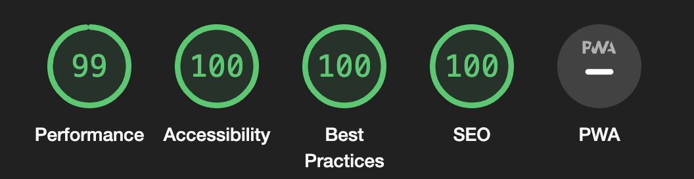
- Mobile
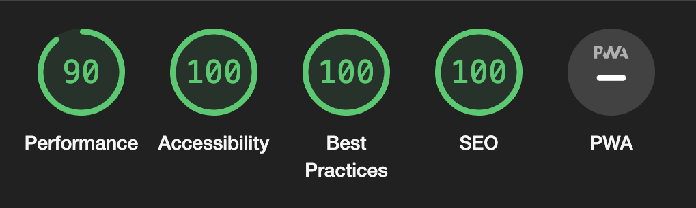

#### __General Testing__
- __As a first-time visitor, I want to be able to play a game from start to finish,  which includes the functionality listed below as MVP__

|          **Feature tested**         | **How it was tested**                                                                                                                        | **Test result** |                                                                              **Comments**                                                                             |
|:-------------------------------------------:|----------------------------------------------------------------------------------------------------------------------------------------------|:---------------:|:---------------------------------------------------------------------------------------------------------------------------------------------------------------------:|
| 1 Player Game                               | Played the game from start to finish                                                                                                         | Pass            |                                                                                                                                                                       |
| Picking a field for the current turn        | Verified that any field can be picked for the score at any round of the game                                                                 | Pass            | Also made sure that it can be picked after one, two, or three rolls, but not before rolling at least once                                                              |
| Calculating a score per field               | Tried to enter a score in each field of the game to see if the calculation was correct                                                       | Pass            |                                                                                                                                                                       |
| Calculating the total score on every turn   | Checked the total score after entering a score every round                                                                                   | Pass            |                                                                                                                                                                       |
| Ending a turn once a field is picked        | Verified that the counter for rounds is decreased and the rolls per turn are reset to 3                                                   | Pass            |                                                                                                                                                                       |
| Rolling the dice                            | Rolled the dice and checked that the values change in a properly random pattern                                                              | Pass            |                                                                                                                                                                       |
| Indicating how many rolls are left per turn | Verified that the rolls counter behaves as expected after rolling (decreasing the turns),  as well as after entering a score (resetting to 3) | Pass            |                                                                                                                                                                       |
| Locking the dice                            | Verified that dice can be locked and unlocked at any point during the rolls, but not before rolling at least once                            | Pass            | Also made sure that the dice automatically get unlocked after entering a score                                                                                        |
| Displaying the rules                        | Clicked on the rules button and made sure that the styling looks good and it is readable                                                     | Pass            | Also made sure that it is not refreshing the page, so the game can be picked up at the same point again Also made sure that the Back to game button works as expected |

- __As a first-time visitor, I want to have a personalized game experience__
  
| **Feature tested**                                                  | **How it was tested**                                                                                                                  | **Test result** |                                                                    **Comments**                                                                   |
|-----------------------------------------------------------------------------|----------------------------------------------------------------------------------------------------------------------------------------|:---------------:|:-------------------------------------------------------------------------------------------------------------------------------------------------:|
| The changing of the player name                                             | Entered a name in the confirm popup and checked the table header                                                                       | Pass            | Also clicked on the table header to get the confirm popup and change the name midgame to verify the functionality of the feature at any point of the game |
| Using a random name if the player doesn't want to enter a name via API call | Clicked on cancel in the confirm popup to see if a random name populates the table header                                              | Pass            |                                                                                                                                                   |
| Diverting to a default name if the API call for the random name fails       | Changed the URL for the API call and then clicked on cancel in the confirm popup to see if the default name populates the table header | Pass            |                                                                                                                                                   |

- __As a returning visitor, I want to be able to see my previous scores__

| **Feature tested**                            | **How it was tested**                                                                                                                                 | **Test result** | **Comments** |
|-----------------------------------------------|-------------------------------------------------------------------------------------------------------------------------------------------------------|:---------------:|:------------:|
| Adding Highscores at the end of a game     | Played a game to the end and then checked that the score was shown in the Highscores section                                                          | Pass            |              |
| Getting/Setting of Highscores in localStorage | After setting a highscore, refreshed the page to see if the score was still shown in the Highscores section                                           | Pass            |              |
| Styling of Highscores section                 | Clicked on the Highscores button to see that the page overlayed the main area, all other sections/divs were hidden and the Back to the game button worked | Pass            |         Also added a "challenge" in the Highscores in the default Highscore array     |

- __As a returning visitor, I want to have my name saved from a previous visit__

| **Feature tested**                             | **How it was tested**                                                                            | **Test result** | **Comments** |
|------------------------------------------------|--------------------------------------------------------------------------------------------------|:---------------:|:------------:|
| Setting/Getting of player name in localStorage | After picking a name, refreshing the page to see if the name showed up in the table header again | Pass            |              |

- __As a business, I want to offer a polished product__

| **Feature tested**                                                       | **How it was tested**                                       | **Test result** | **Comments** |
|--------------------------------------------------------------------------|-------------------------------------------------------------|:---------------:|:------------:|
| Button feedback on hover                                                 | Hovered and clicked on buttons                              | Pass            |              |
| Table feedback on hover                                                  | Hovered over the different table rows                       | Pass            |              |
|                                                                          |                                                             |                 |              |
| Checked responsiveness of the site on:                                   |                                                             |                 |              |
| iPhone 12 pro                                                            | Navigated the site and played the game from start to finish | Pass            |              |
| iPhone 14 pro                                                            | Navigated the site and played the game from start to finish | Pass            |              |
| iPad mini                                                                | Navigated the site and played the game from start to finish | Pass            |              |
| MacBook Pro 16"                                                          | Navigated the site and played the game from start to finish | Pass            |              |
| Huawei Honor 9x Lite                                                     | Navigated the site and played the game from start to finish | Pass            |              |
| Windows 10 with 34" screen                                               | Navigated the site and played the game from start to finish | Pass            |              |
| Windows 11 on Dell Laptop 16"                                            | Navigated the site and played the game from start to finish | Pass            |              |
| Chrome Dev Tools on different screen resolutions from 340px up to 1400px | Navigated the site and played the game from start to finish | Pass            |              |

- __As a business, I want to offer a fun game experience__

| **Feature tested**                                | **How it was tested**                                                                                                                      | **Test result** |                         **Comments**                         |
|---------------------------------------------------|--------------------------------------------------------------------------------------------------------------------------------------------|:---------------:|:------------------------------------------------------------:|
| Display of hint for an easy introduction to gameplay | Refreshed the site and checked that the correct hint is displayed at the correct point of the game                                         | Pass            |                                                              |
| Feedback for inappropriate user actions           | Played the game and checked for alerts when:                                                                                               |                 |                                                              |
|                                                   | tried rolling the dice when no turns are left                                                                                              | Pass            |                                                              |
|                                                   | tried adding a score before rolling                                                                                                        | Pass            |                                                              |
|                                                   | tried adding a score in a field already filled                                                                                             | Pass            |                                                              |
|                                                   | tried locking the dice before rolling in the new turn                                                                                      | Pass            |                                                              |
| General "fun" game experience                     | Played the game from start to finish several times in a row myself and had people test the site as well who gave feedback that it was fun  | Pass            | People said it was even fun when they didn't know what to do  |

### Bugs

#### __Known Bugs__
At the point of deployment, there were no known, unfixed bugs. 

#### __Fixed Bugs__

During development, the following bugs were identified and fixed:
- After finishing a game and starting a new one, the total score still displays the last total score
  - Fix: Set the totalScoreDisplay to '0' in the runGame() function
- After finishing a game and starting a new one, the dice cannot be toggled anymore
  - Fix: Removed the eventListeners from the runGame() function and instead added them when the page loads
- Highscores do not persist through refreshing the page
  - Fix: Add an if-clause to the getHighscores() function that checks if localStorage already has the highscores and if it doesn't it sets the starting array, otherwise it sets the Highscores fetched from localStorage
- When running the site through the HTML validator, it gave a warning there were three sections without headings
  - Fix: Changed the sections into divs
- When opening the highscores, the Hint was still shown
  - Fix: set 'display: none' for hintArea.style in displayHighscores() function
- When changing playerName from a random name to a picked name, the random name was entered into highscores
  - Fix: The function to pick a name was not setting the playerName as newName, so I added it 

## Deployment 

- The site was deployed to GitHub pages. The steps to deploy are as follows: 
  - In the GitHub repository, navigate to the Settings tab 
  - From the source section drop-down menu, select the main Branch
  - Once the main branch has been selected, the page will be automatically refreshed with a detailed ribbon display to indicate the successful deployment. 

The live link can be found here: https://hashtag-squirrel.github.io/five-dice/

## Credits 

### Content 

- Articles referred to in-depth: 
    - [Fetch API Documentation](https://www.w3schools.com/jsref/api_fetch.asp)
    - [localStorage Documentation](https://developer.mozilla.org/en-US/docs/Web/API/Window/localStorage)
    - [Set and Get objects/array in localStorage](https://stackoverflow.com/questions/3357553/how-do-i-store-an-array-in-localstorage)

### Media

#### __Images__
- Dice with shadow (used for logo):
  - https://pixabay.com/vectors/one-dice-eyes-gamble-luck-chance-310338/
  - https://pixabay.com/vectors/two-dice-eyes-gamble-luck-chance-310337/
  - https://pixabay.com/vectors/three-dice-eyes-gamble-luck-310336/
  - https://pixabay.com/vectors/dice-four-eyes-gamble-luck-chance-310335/
  - https://pixabay.com/vectors/five-dice-eyes-gamble-luck-chance-310334/
  - https://pixabay.com/vectors/dice-six-eyes-gamble-luck-chance-310333/

- Dice without shadow (used for the game area):
  - https://pixabay.com/vectors/dice-rolling-throwing-one-dot-312625/
  - https://pixabay.com/vectors/dice-throwing-rolling-two-dots-312627/
  - https://pixabay.com/vectors/dice-roll-three-dots-luck-risk-312624/
  - https://pixabay.com/vectors/dice-four-dots-luck-gambling-312623/
  - https://pixabay.com/vectors/dice-five-gambling-luck-chance-312622/
  - https://pixabay.com/vectors/dice-gambling-play-chance-cube-312621/

